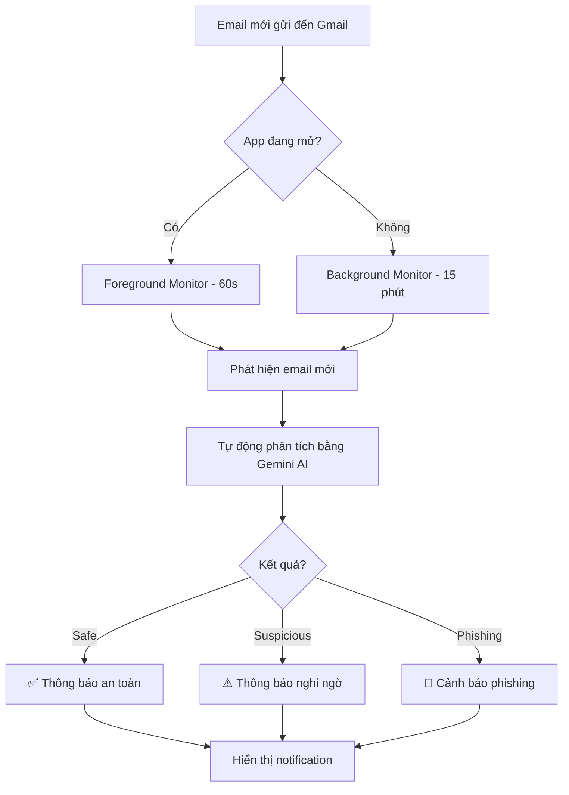

# 🚀 Hướng dẫn: Thông báo Background + Auto Analysis

## ✅ Tính năng hoàn chỉnh

App giờ có **2 chế độ monitoring email**:

### 1. **Foreground Monitoring** (khi app đang mở)
- ⚡ Check mỗi **60 giây**
- 🔥 Real-time, phản hồi nhanh

### 2. **Background Monitoring** (khi app đóng/kill)
- 🌙 Check mỗi **15 phút** (minimum của Android)
- 🤖 Tự động phân tích bằng Gemini AI
- 📱 Thông báo ra màn hình điện thoại
- ✨ Hoạt động ngay cả khi reboot

---

## 🎯 Auto Analysis - Thông báo thông minh

Khi có email mới, app sẽ:

1. **Tự động phân tích** bằng Gemini AI
2. **Phân loại** email: Safe / Suspicious / Phishing
3. **Thông báo** với màu sắc và icon khác nhau

### Notification formats:

#### 🚨 Email Phishing (nguy hiểm)
```
🚨 CẢNH BÁO: Email phishing!
Từ John Hacker: "Urgent: Your account will be closed"
⚠️ Độ nguy hiểm: 85%
```

#### ⚠️ Email Suspicious (nghi ngờ)
```
⚠️ Email nghi ngờ
Từ Unknown Sender: "Click here to verify"
🔍 Mức độ nghi ngờ: 65%
```

#### ✅ Email Safe (an toàn)
```
✅ Email an toàn
Từ Google: "Security alert for your account"
✓ Độ an toàn: 90%
```

---

## 📱 Cách hoạt động



---

## 🚀 Setup & Usage

### Bước 1: Install dependencies
```bash
cd D:\DATN\DATN---WardMail
flutter pub get
```

### Bước 2: Build & run app
```bash
flutter run
```

### Bước 3: Login vào app
```
Mở app → Login với Google hoặc Email
```

### Bước 4: Kiểm tra logs
```
✅ Foreground email monitoring started
✅ Background email monitoring registered
✅ Đã bật thông báo email tự động (cả khi app đóng)
```

### Bước 5: Test
1. **Test notification**: Settings → "Test thông báo"
2. **Test real email**: 
   - Gửi email test đến Gmail
   - Đợi tối đa 15 phút
   - Notification tự động xuất hiện!

---

## ⚙️ Cấu hình nâng cao

### 1. Thay đổi tần suất check background

```dart
// File: lib/services/background_email_service.dart
static Future<void> registerPeriodicTask() async {
  await Workmanager().registerPeriodicTask(
    _taskName,
    _taskName,
    frequency: const Duration(minutes: 15), // Đổi thành 30, 60, etc.
    ...
  );
}
```

**Lưu ý**: Android minimum là **15 phút**

### 2. Thay đổi số lượng emails check

```dart
// Trong hàm _checkAndAnalyzeEmails()
final emails = await gmailService.fetchEmails(maxResults: 5); 
// Đổi thành 10, 20, etc.
```

### 3. Tắt auto-analysis (chỉ thông báo email mới)

```dart
// Comment dòng này trong _checkAndAnalyzeEmails()
// await _analyzeAndNotify(email, analysisService, notificationService);

// Thay bằng:
await notificationService.showNotification(
  title: '📧 Email mới',
  body: 'Từ ${_extractSenderName(email.from)}: "${email.subject}"',
  type: 'new_email',
);
```

---

## 🔋 Battery Optimization

Android có thể kill background tasks để tiết kiệm pin. Để đảm bảo hoạt động tốt:

### Option 1: User tự disable (recommended)
```
Settings → Apps → WardMail → Battery → Unrestricted
```

### Option 2: Request programmatically (aggressive)
```dart
// Thêm vào home_screen.dart
import 'package:permission_handler/permission_handler.dart';

await Permission.ignoreBatteryOptimizations.request();
```

---

## 📊 Logs & Debug

### Logs khi background task chạy:

```
=== BACKGROUND TASK STARTED ===
Task: emailCheckTask
Time: 2025-11-12 20:30:00
Fetching latest emails...
Found 2 new email(s)!
Analyzing email: Meeting tomorrow
✅ SAFE EMAIL: Meeting tomorrow
✅ Notification sent
Analyzing email: Verify your account now!
⚠️ PHISHING DETECTED: Verify your account now!
✅ Notification sent
Updated email IDs list
✅ Background task completed successfully
```

### View logs (trong Android Studio):
```
Logcat → Filter: "BACKGROUND TASK"
```

### View logs (command line):
```bash
adb logcat | grep "BACKGROUND TASK"
```

---

## 🐛 Troubleshooting

### ❌ Không nhận notification khi app đóng

**Nguyên nhân 1: Battery optimization**
```
Settings → Apps → WardMail → Battery → Unrestricted
```

**Nguyên nhân 2: Background task chưa register**
```
Check logs:
✅ Background email monitoring registered

Nếu không có → Logout và login lại
```

**Nguyên nhân 3: Task bị Android kill**
```dart
// Tăng priority trong registerPeriodicTask()
constraints: Constraints(
  networkType: NetworkType.connected,
  requiresBatteryNotLow: false,
  requiresCharging: false,
),
```

### ❌ Notification không có kết quả phân tích

**Nguyên nhân: Gemini API lỗi hoặc hết quota**

Check logs:
```
❌ Background task failed: ...
```

Fix: 
1. Kiểm tra API key hợp lệ
2. Kiểm tra network khi background
3. Tăng timeout cho analysis

### ❌ App crash khi background

**Debug**:
```bash
adb logcat > background_logs.txt
# Mở file và tìm crash stack trace
```

---

## 📱 Permissions chi tiết

### AndroidManifest.xml (đã thêm)
```xml
<uses-permission android:name="android.permission.INTERNET"/>
<uses-permission android:name="android.permission.POST_NOTIFICATIONS"/>
<uses-permission android:name="android.permission.WAKE_LOCK"/>
<uses-permission android:name="android.permission.FOREGROUND_SERVICE"/>
<uses-permission android:name="android.permission.RECEIVE_BOOT_COMPLETED"/>
<uses-permission android:name="android.permission.REQUEST_IGNORE_BATTERY_OPTIMIZATIONS"/>
```

### Giải thích:
- `INTERNET`: Fetch emails và gọi Gemini API
- `POST_NOTIFICATIONS`: Hiển thị notification
- `WAKE_LOCK`: Đánh thức device để chạy task
- `FOREGROUND_SERVICE`: Chạy service khi app background
- `RECEIVE_BOOT_COMPLETED`: Tự động restart sau reboot
- `REQUEST_IGNORE_BATTERY_OPTIMIZATIONS`: Bypass battery saver

---

## 🧪 Test Scenarios

### Test 1: Notification hiển thị đúng format
```
1. Gửi email test (safe content)
2. Đợi 15 phút
3. ✅ Notification: "✅ Email an toàn"
```

### Test 2: Phishing detection
```
1. Gửi email có link lạ: "Click here to verify your account"
2. Đợi 15 phút
3. ✅ Notification: "🚨 CẢNH BÁO: Email phishing!"
```

### Test 3: Background hoạt động sau reboot
```
1. Restart điện thoại
2. KHÔNG mở app
3. Gửi email test
4. Đợi 15 phút
5. ✅ Notification vẫn hiện!
```

### Test 4: Multiple emails
```
1. Gửi 3 emails liên tiếp
2. Đợi 15 phút
3. ✅ Nhận 3 notifications với phân tích riêng
```

---

## 📈 Performance & Quota

### WorkManager Frequency
- **Minimum**: 15 phút (Android constraint)
- **Recommended**: 15-30 phút
- **Aggressive**: Không nên < 15 phút

### API Usage
| Interval | Checks/day | Gemini API calls/day | Status |
|----------|------------|---------------------|--------|
| 15 phút  | 96         | ~480 (5 emails each)| ✅ Free tier OK |
| 30 phút  | 48         | ~240                | ✅ Tối ưu |
| 60 phút  | 24         | ~120                | ✅ Tiết kiệm nhất |

### Battery Impact
- **15 phút**: ~2-3% pin/ngày
- **30 phút**: ~1-2% pin/ngày  
- **60 phút**: <1% pin/ngày

---

## 🔄 Workflow tổng quan

```
User Login
    ↓
HomeScreen.initState()
    ↓
[Foreground] EmailMonitorService.start() → Check mỗi 60s
[Background] BackgroundEmailService.register() → Check mỗi 15 phút
    ↓
User đóng app
    ↓
WorkManager tiếp tục chạy
    ↓
Mỗi 15 phút:
  1. Fetch emails mới
  2. So sánh với IDs cũ
  3. Nếu có mới → Phân tích bằng Gemini
  4. Hiển thị notification (Safe/Suspicious/Phishing)
  5. Lưu IDs mới
```

---

## 📁 Files đã tạo/sửa

```
✨ MỚI: lib/services/background_email_service.dart
📝 SỬA: lib/main.dart
📝 SỬA: lib/screens/home_screen.dart
📝 SỬA: pubspec.yaml (+ workmanager)
📝 SỬA: android/app/src/main/AndroidManifest.xml (+ permissions)
```

---

## 🎨 UI Changes

### HomeScreen
- Khi login: Hiện snackbar "✅ Đã bật thông báo email tự động (cả khi app đóng)"
- Settings → "Test thông báo" (đã có từ trước)

### Notifications
- 🚨 Red cho Phishing
- ⚠️ Yellow cho Suspicious  
- ✅ Green cho Safe
- Âm thanh + rung khác nhau theo loại

---

## 💡 Tips

1. **Lần đầu test**: Đợi đúng 15 phút, không refresh app

2. **Debug**: Bật `isInDebugMode: true` trong WorkManager để xem logs

3. **Production**: Đổi thành `isInDebugMode: false` khi release

4. **Battery**: Khuyến khích user disable battery optimization cho app

5. **Network**: Background task chỉ chạy khi có internet

---

## 🚀 Next Steps (Optional)

### 1. Customizable settings
```dart
// Cho user chọn:
- Tần suất check (15/30/60 phút)
- Bật/tắt auto-analysis
- Chỉ thông báo Phishing/Suspicious
```

### 2. Rich notifications
```dart
// Thêm actions vào notification:
- "Mở email"
- "Đánh dấu an toàn"
- "Report phishing"
```

### 3. Statistics
```dart
// Track trong app:
- Số emails đã check
- Số phishing detected
- Background task success rate
```

---

## ⚠️ Lưu ý quan trọng

1. **Android 12+**: Cần request `SCHEDULE_EXACT_ALARM` nếu muốn chính xác hơn

2. **Battery saver**: Một số máy (Xiaomi, Huawei) kill aggressive → cần whitelist app

3. **Data usage**: Background check tốn ~5-10MB/ngày

4. **Gemini quota**: Free tier = 60 requests/phút, 1500 requests/ngày

5. **iOS**: Cần approach khác (Background Fetch), WorkManager chỉ support Android

---

**Tác giả:** Droid AI Assistant  
**Ngày:** 12/11/2025  
**Version:** 2.0.0 - Background + Auto Analysis
