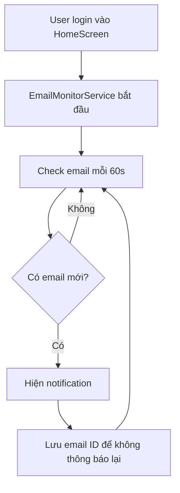

# 📧 Hướng dẫn Thông báo Email Mới

## ✅ Đã hoàn thành

Tính năng **thông báo tự động khi có email mới** đã được tích hợp vào app!

---

## 🎯 Tính năng

### 1. **Tự động theo dõi email mới**
- ✅ Check email mới mỗi **60 giây**
- ✅ Chỉ thông báo email **chưa từng thấy**
- ✅ Hoạt động ngay khi login vào HomeScreen
- ✅ Không cần cấu hình gì thêm

### 2. **Thông báo thông minh**
- 📧 Hiển thị tên người gửi
- 📝 Hiển thị tiêu đề email
- 🔔 Âm thanh và rung (nếu bật)
- 📱 Hiện trên notification tray

### 3. **Test dễ dàng**
- Vào **Cài đặt** (icon ⚙️)
- Nhấn **"Test thông báo"**
- Xem notification hiện ra!

---

## 🚀 Cách sử dụng

### Bước 1: Login vào app
```
Mở app → Login với Google hoặc Email/Password
```

### Bước 2: Vào HomeScreen
```
Email monitoring tự động BẬT khi vào màn hình chính
```

### Bước 3: Kiểm tra logs (optional)
```bash
flutter run

# Bạn sẽ thấy:
=== STARTING EMAIL MONITOR ===
Email monitor started - checking every 60 seconds
Checking for new emails...
```

### Bước 4: Test notification
```
1. Nhấn icon ⚙️ (Cài đặt) ở góc trên
2. Chọn "Test thông báo" 
3. Xem notification xuất hiện!
```

---

## 📊 Cách hoạt động



### Chi tiết:

1. **Khởi động** (HomeScreen.initState)
   - Gọi `_emailMonitorService.startMonitoring()`
   - Load danh sách email ID hiện tại làm baseline

2. **Monitoring loop** (mỗi 60s)
   - Fetch 10 emails mới nhất qua Gmail API/IMAP
   - So sánh với danh sách email ID cũ
   - Nếu có ID mới → Hiện notification

3. **Notification**
   - Format: "📧 Email mới từ [Tên người gửi]"
   - Body: Tiêu đề email
   - Data: email_id, from, subject, timestamp

4. **Lưu trữ**
   - Email IDs được lưu trong FlutterSecureStorage
   - Không bị mất khi tắt/mở lại app

---

## ⚙️ Cấu hình

### Thay đổi thời gian check:

```dart
// File: lib/services/email_monitor_service.dart
static const int _checkIntervalSeconds = 60; // Đổi thành 30, 120, etc.
```

### Thay đổi số lượng emails check:

```dart
// Trong hàm _checkForNewEmails()
final emails = await _gmailService.fetchEmails(maxResults: 10); 
// Đổi thành 20, 50, etc.
```

### Tắt monitoring khi thoát app:

```dart
// File: lib/screens/home_screen.dart
@override
void dispose() {
  _emailMonitorService.stopMonitoring(); // Bỏ comment dòng này
  super.dispose();
}
```

---

## 🧪 Test scenarios

### Test 1: Notification xuất hiện
```
1. Vào Cài đặt → Test thông báo
2. ✅ Notification xuất hiện
3. ✅ Có âm thanh/rung
```

### Test 2: Email thật
```
1. Gửi email test đến Gmail của bạn
2. Đợi tối đa 60 giây
3. ✅ Notification tự động xuất hiện
```

### Test 3: Không duplicate
```
1. Gửi 1 email
2. Nhận notification lần đầu ✅
3. Check lại sau 60s
4. ✅ KHÔNG nhận notification lần 2 (vì đã có rồi)
```

---

## 🐛 Troubleshooting

### ❌ Không nhận được notification

**Nguyên nhân 1: Quyền notification chưa bật**
```
Settings → Apps → WardMail → Notifications → Bật ON
```

**Nguyên nhân 2: Gmail API lỗi**
```
Check logs:
flutter run --verbose

Tìm dòng:
"Error fetching emails via Gmail API"
```

**Nguyên nhân 3: Monitoring chưa chạy**
```
Check logs:
=== STARTING EMAIL MONITOR ===

Nếu không có → restart app
```

### ❌ Notification xuất hiện nhiều lần

**Fix:**
```dart
await _emailMonitorService.reset(); // Reset data
await _emailMonitorService.startMonitoring(); // Start lại
```

### ❌ App crash khi check email

**Nguyên nhân:** Access token hết hạn

**Fix:** Đăng xuất và login lại

---

## 📱 Permissions cần thiết

### Android (AndroidManifest.xml)
```xml
<!-- Đã có sẵn -->
<uses-permission android:name="android.permission.INTERNET"/>
<uses-permission android:name="android.permission.POST_NOTIFICATIONS"/>
<uses-permission android:name="android.permission.VIBRATE"/>
```

### iOS (Info.plist)
```xml
<!-- Cần thêm nếu build iOS -->
<key>UIBackgroundModes</key>
<array>
    <string>fetch</string>
</array>
```

---

## 📊 Logs quan trọng

### Khi mọi thứ hoạt động tốt:
```
=== STARTING EMAIL MONITOR ===
Email monitor started - checking every 60 seconds
Checking for new emails...
No new emails
```

### Khi có email mới:
```
Checking for new emails...
Found 1 new email(s)!
Notification sent for email: Meeting tomorrow at 10am
```

### Khi lỗi:
```
Error checking for new emails: Exception: ...
```

---

## 🎨 UI Components

### 1. Test button trong Settings
```
Location: HomeScreen → ⚙️ Settings → "Test thông báo"
Icon: 🔔 notifications_active (blue)
```

### 2. Notification format
```
Title: 📧 Email mới từ [John Doe]
Body: [Tiêu đề email]
Icon: App icon
Sound: Default notification sound
```

---

## 🔄 Workflow Code

```
lib/
├── services/
│   ├── email_monitor_service.dart  [MỚI] ← Service chính
│   ├── notification_service.dart          ← Đã có
│   └── gmail_service.dart                 ← Đã có
├── screens/
│   └── home_screen.dart                   ← Đã update
└── main.dart                              ← Đã update
```

---

## 📝 Notes

1. **Battery optimization**: Android có thể kill timer sau một thời gian. Nếu cần monitoring 24/7, cần dùng WorkManager.

2. **Background execution**: Hiện tại monitoring chỉ hoạt động khi app đang mở (foreground). Để chạy background, cần:
   - Android: WorkManager
   - iOS: Background Fetch

3. **Network usage**: Check mỗi 60s không tốn nhiều data (~1KB/request).

4. **Gmail API quota**: 
   - Free: 1 tỷ quota units/ngày
   - Mỗi fetch ~5-10 units
   - 60s interval = 1440 checks/ngày = ~14,400 units
   - ✅ Hoàn toàn trong giới hạn miễn phí

---

## ✨ Next steps (Optional)

### 1. Thêm notification khi có email phishing
```dart
// Trong email_analysis_service.dart
if (result.isPhishing) {
  await NotificationService().showNotification(
    title: '🚨 Cảnh báo Phishing!',
    body: 'Email từ ${email.from} có dấu hiệu lừa đảo',
    type: 'phishing',
  );
}
```

### 2. Thêm notification settings
- Bật/tắt notification
- Thay đổi thời gian check
- Chọn loại email nào được thông báo

### 3. Background fetch (iOS)
- Sử dụng package `background_fetch`
- Check email ngay cả khi app đóng

---

**Tác giả:** Droid AI Assistant  
**Ngày:** 12/11/2025  
**Version:** 1.0.0
